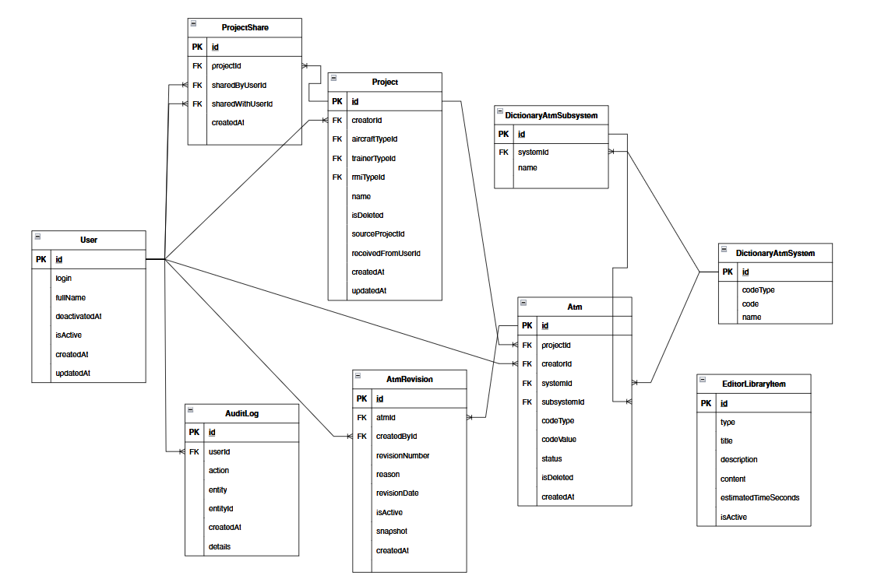

# Веб-сервис «АТМ-Конструктор»

## Что это?
«АТМ-Конструктор» - это специализированный веб-сервис, предназначенный для автоматизации составления приемно-сдаточных испытаний (АТМ — Acceptance Test Manual) испытательных стендов. 

Система позволяет составителям избавится от ручного форматирования АТМ в редакторе MS Word, автоматизируя создание структуры документа, ведения версионирования (ревизий), автосохранение данных и экспорт готовых документов в формат .docx по строго заданному шаблону предприятия ГосНИИАС.

### Ключевой функционал:
* Создание, клонирование, архивация в корзину и поиск по проектам авиатренажеров.
* Возможность полностью передать личный проект со всеми ревизиями другому зарегистрированному пользователю.
* Привязка документов к международным авиационным стандартам систем (ATA/FSTD) с автоматическим подбором названий.
* Изолированное ведение разделов (Титульный лист, Лист согласования, Регистрация изменений, Лабораторное оборудование, Допуски, Аббревиатуры).
* Фоновое автосохранение изменений каждые 5 минут и система контроля состояний.
* Автоматическое копирование и заморозка данных предыдущих ревизий при создании новой ревизии.

## Стек технологий

При проектировании и разработке микросервисной архитектуры приложения использовались следующие инструменты:

### Фронтенд (Клиентская часть):
* React — позволяет удобно делить сложное пространство сайта на отдельные, независимые компоненты, которые можно использовать повторно в других местах, и легко создавать любые нестандартные элементы.
* Vite — обеспечивает моментальный запуск программы на компьютере и мгновенное обновление экрана в браузере при любых изменениях в коде.
* React Router — обеспечивает быстрое переключение между страницами веб-сервиса без перезагрузки экрана в браузере.
* SCSS — позволяет настроить уникальный внешний вид веб-сервиса с нуля без использования перегруженных готовых фреймворков. За счет вложенности и переменных делает код стилей чистым и простым для редактирования.

### Бэкенд (Серверная часть):
* Node.js — позволяет применять один и тот же язык программирования (JavaScript) для клиентской и серверной частей, что сокращает время написания кода, хорошо подходит для API-сервисов.
* Express.js — не заставляет использовать тяжелые готовые шаблоны кода и лишние функции, давая возможность полностью настроить систему под себя.
* Prisma ORM — предлагает наглядный и простой формат для описания структуры таблиц, автоматически создает безопасные запросы к базе данных и берет на себя управление миграциями.

### База данных:
* PostgreSQL — база данных построена на строгой реляционной структуре, которая необходима для настройки четких взаимосвязей между пользователями, проектами, АТМ и справочниками. Система хорошо работает в связке с Prisma ORM.

## Запуск программы

Для развертывания всего окружения веб-сервиса одной командой используется Docker Compose. На вашем компьютере должен быть установлен и запущен Docker Desktop.

Клонируйте репозиторий проекта:
   ```bash
   git clone https://github.com/YarikVyr/CursovayaRabota.git
   ```
Перейдите в корневую директорию проекта:

   ```bash
   cd "ATM Constructor"
   ```
Разверните и соберите контейнеры в фоновом режиме:

   ```bash
   docker compose up -d --build
   ```
Docker автоматически поднимет реляционную базу данных PostgreSQL, соберёт образ бэкенда из локальной папки и скомпилирует фронтенд.

Откройте веб-сервис в браузере: http://localhost:3000

## ER-диаграмма
Для создания логической структуры ключевых таблиц базы данных, состоящей из 9-ти таблиц, была разработана ER-диаграмма (Рис.1). Она построена на основе реляционной модели, где таблицы соединяются друг с другом с помощью первичных ключей (PK) и внешних ключей (FK).


Рис. 1. Логическая схема структуры базы данных веб-сервиса

### 1. Связи таблицы User (Пользователи)
Главной таблицей является таблица User (Пользователи). Идентификатор User.id является главным ключом, от которого исходят связи типа «один ко многим»:

* Связь User.id с Project.creatorId означает, что один пользователь может создать много проектов и является их создателем.
* Связь User.id с Atm.creatorId означает, что один пользователь может быть создателем для множества АТМ.
* Связь User.id с ProjectShare.sharedByUserId означает, что один пользователь может поделиться множеством своих проектов с другими пользователями.
* Связь User.id с ProjectShare.sharedWithUserId означает, что одному пользователю может быть открыт совместный доступ ко множеству чужих проектов.
* Связь User.id с AtmRevision.createdById означает, что один пользователь может зафиксировать и сохранить множество различных ревизий в процессе работы над АТМ.
* Связь User.id с AuditLog.userId означает, что один пользователь совершает множество действий в системе, и все они записываются в журнал действий в админ-панели для контроля безопасности.

### 2. Связи таблицы Project (Проекты)
Идентификатор Project.id связывает карточку проекта с другими сущностями с помощью связи «один ко многим»:

* Связь Project.id с Atm.projectId означает, что один проект содержит внутри себя много АТМ.
* Связь Project.id с ProjectShare.projectId означает, что одним проектом можно поделиться много раз с разными пользователями, предоставляя им права на совместную работу над проектом.

### 3. Связи таблицы Atm (АТМ)
Идентификатор Atm.id необходим для работы с ревизиями и справочниками. На него ссылаются или он сам ссылается на другие таблицы:

* Связь Atm.id с AtmRevision.atmId (связь «один ко многим») означает, что один АТМ имеет историю из множества ревизий.
* Связь DictionaryAtmSystem.id с Atm.systemId (связь «один ко многим») означает, что к одной конкретной системе может относиться множество созданных АТМ.
* Связь DictionaryAtmSubsystem.id с Atm.subsystemId (связь «один ко многим») означает, что к одной конкретной подсистеме может относиться множество АТМ.

### 4. Иерархия справочников и особенности структуры библиотеки элементов
Справочники систем и подсистем имеют строгую иерархию, что необходимо для реализации зависимых выпадающих списков в пользовательском интерфейсе:

* Связь DictionaryAtmSystem.id с DictionaryAtmSubsystem.systemId (связь «один ко многим») означает, что одна система декомпозируется на множество мелких подсистем тренажера.

Особое положение таблицы EditorLibraryItem: данная таблица намеренно расположена изолированно и не имеет прямых связей с таблицами систем и подсистем. На текущем этапе разработки веб-сервиса дерево элементов и правила применимости шаблонов хранятся в упрощенном виде — напрямую внутри полей формата JSON. Такое решение выбрано для гибкости, что позволяет быстро менять состав элементов библиотеки в коде бэкенда и не тратить ресурсы на выполнение сложных запросов слияния таблиц. В дальнейшем данные из JSON-полей планируется нормализовать и распределить по отдельным связанным таблицам.

## Авторство и Лицензия
Автор проекта: Ярослав Межибор

## Лицензия:
Данный программный продукт является прототипом коммерческой разработки, созданным с учетом требований стандартов ГосНИИАС.
