# ВЕБ-СЕРВИС ДЛЯ АВТОМАТИЗИРОВАННОГО ДОКУМЕНТООБОРОТА ПРИЕМНО-СДАТОЧНЫХ ИСПЫТАНИЙ «АТМ-КОНСТРУКТОР»

## РУКОВОДСТВО ПОЛЬЗОВАТЕЛЯ

## 1. Введение

### 1.1. Область применения 
Веб-сервис предназначен для составления приемно-сдаточных испытаний (АТМ, далее – документы испытания) авиатренажера. 

### 1.2. Краткое описание возможностей 
Веб-сервис предоставляет следующие возможности: 
* Авторизация и регистрация пользователя.
* Разделение проектов на личные (для работы над ними самим пользователем) и общие (для просмотра наработок других пользователей).
* Возможность полностью передать личный проект со всеми ревизиями другому зарегистрированному пользователю.
* Создание документа испытаний под конкретные авиатренажеры с привязкой к международным кодам (ATA или FSTD) и автоматическим подбором названий систем и подсистем.
* Контроль текущего состояния АТМ через систему статусов (*Черновик, В работе, На проверке, Готово*).
* Быстрое наполнение документа путем перетаскивания готовых проверок и результатов из системной библиотеки.
* Фоновое автосохранение изменений раз в 5 минут для защиты от потери информации и предпросмотр всех разделов.
* Автоматическое наполнение полей титульного листа для области общих сведений, загрузка логотипов компаний.
* Заполнение полей компании и их сотрудников для листа согласования.
* Автоматическое копирование всех данных при создании новой ревизии документа и возможность просмотра старых версий без их редактирования.
* Экспорт готового структурированного файла формата `.docx` строго по отраслевому шаблону на выбранном языке (русском или английском).
* Управление через административную панель пользователями, справочниками, основной частью конструктора.

### 1.3. Уровень подготовки пользователей 
Пользователи веб-сервиса должны обладать следующими минимальными навыками для работы:
1. Навык составления документов испытаний для авиатренажера.
2. Уверенное владение современными интернет-браузерами, умение работать с современными операционными системами и сайтами.
3. Умение работать с загруженными файлами формата `.docx` для финальной проверки сгенерированных шаблонов.
4. Базовое понимание кодирования авиационных систем ATA / FSTD.

## 3. Описание операций 

### 3.1. Страница авторизации

При авторизации в систему на экране будет открыта форма. Для регистрации необходимо заполнить поля в окне «Регистрация»: ФИО, Логин, Пароль (можно просматривать введенный пароль, нажав на соответствующую иконку). По завершении нажать на кнопку «Создать аккаунт» (рис. 1). После этого в базе данных создастся новая учетная запись.

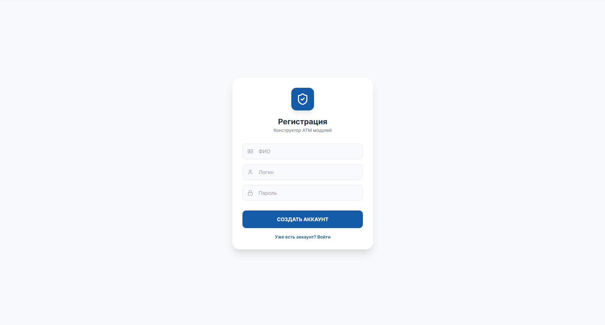
Рис. 1. Форма регистрации в веб-сервисе

Для того, чтобы совершить вход уже зарегистрированному пользователю в веб-сервис необходимо перейти в окно «Вход в систему» and заполнить поля: логин и пароль. По завершении нажать на кнопку «Войти» (рис. 2). 

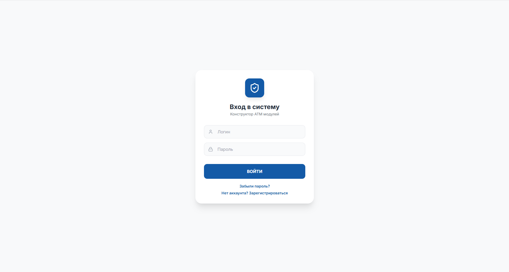
Рис. 2. Форма входа в веб-сервисе

### 3.2. Главная страница веб-сервиса (страница проектов)

Авторизованный пользователь направляется на главную страницу. На главной странице находится управление проектами веб-сервиса: их создание, редактирование, удаление в корзину и восстановление. А также разделение на личные проекты пользователя (раздел «Мои проекты») и проекты, которые создали другие пользователи в веб-сервисе (раздел «Все проекты»), поиск проектов, переключение языка и кнопка выхода сверху (рис. 3).

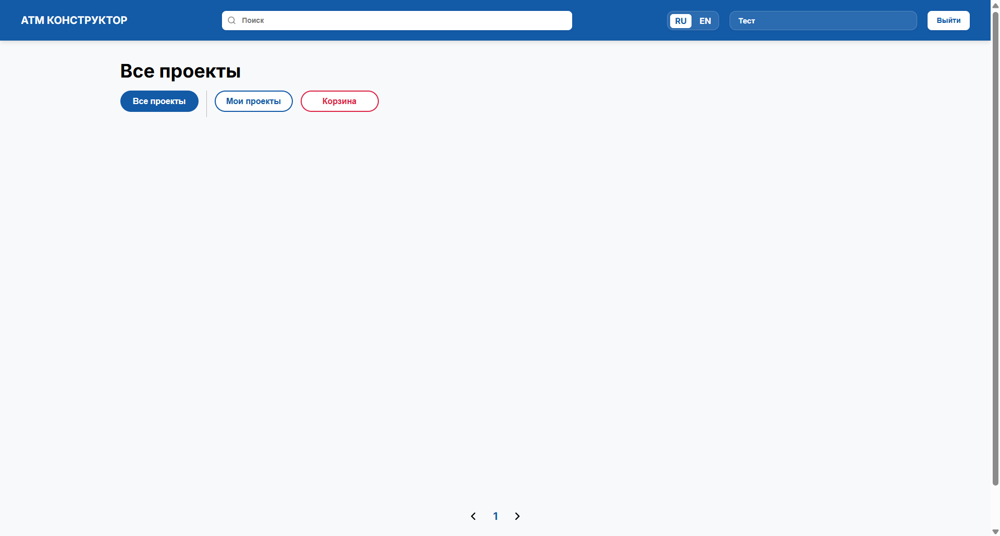
Рис. 3. Главная страница веб-сервиса

Для просмотра чужих проектов необходимо перейти на вкладку «Все проекты» и нажать на кнопку на карточке проекта «Посмотреть» (рис. 4).

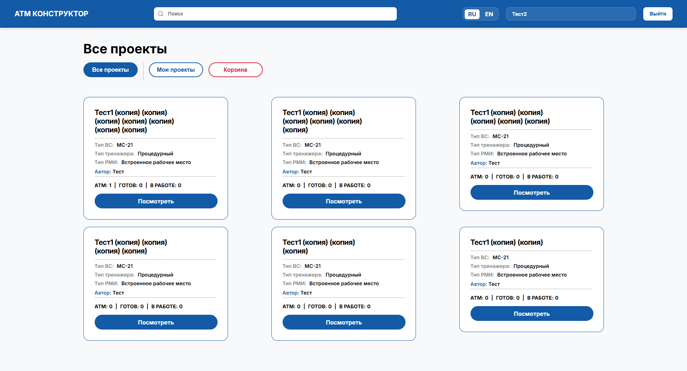
Рис. 4. Созданные карточки других пользователей, предназначенные только для просмотра

Для того, чтобы создать новый проект необходимо перейти на вкладку «Мои проекты» и нажать на поле создания проекта (рис. 5).

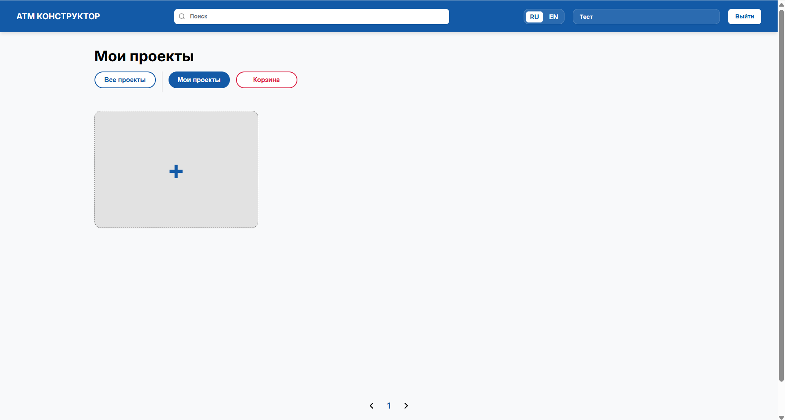
Рис. 5. Вкладка «Мои проекты» с полем создания проекта

В форме создания проекта необходимо заполнить название, тип воздушного судна (ВС), тип тренажера и тип рабочего места инструктора (РМИ) и нажать на кнопку «Создать» (рис. 6).

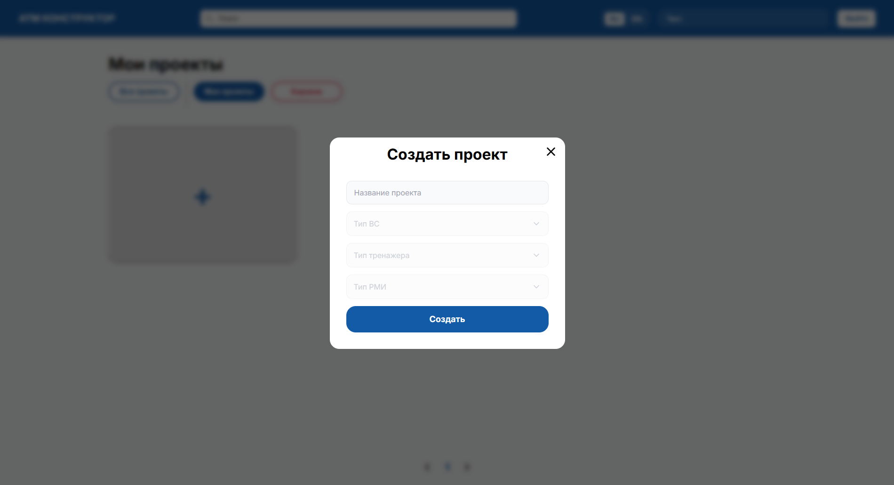
Рис. 6. Форма создания проекта

Далее есть возможность отредактировать проект, наведясь на карточку проекта и нажав на соответствующую иконку карандаша, копировать проект (при этом у названия проекта появится слово «копия») и удалить проект (проект окажется во вкладке корзина) (рис. 7).

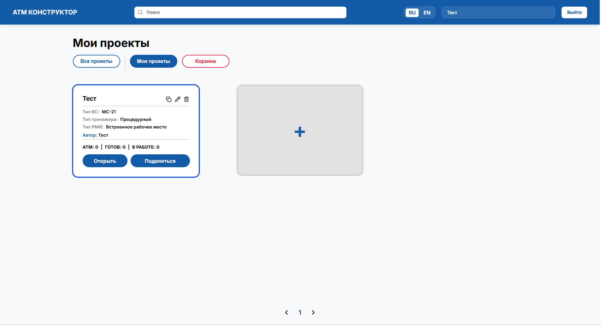
Рис. 7. Иконки на карточке проекта

Для того чтобы восстановить проект из корзины необходимо перейти в нее и нажать на кнопку «Восстановить» (рис. 8).

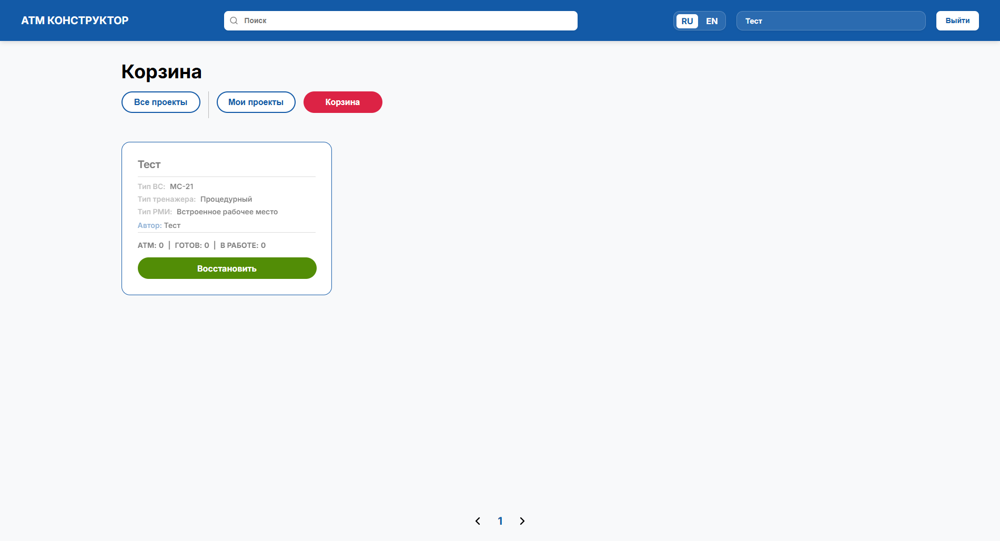
Рис. 8. Карточка на вкладке восстановления проекта

У пользователя есть возможность перелистывать проекты, если их становится много на странице (рис. 9).

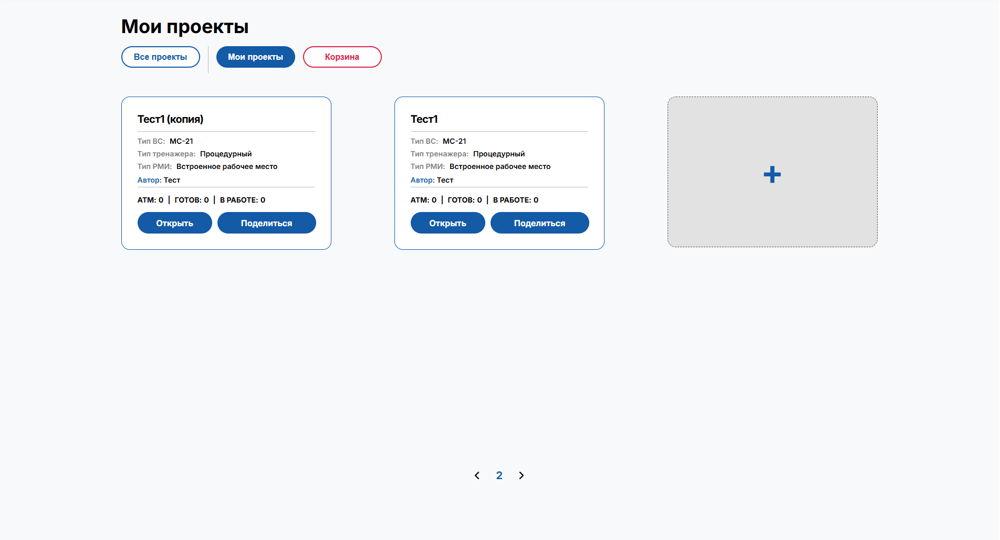
Рис. 9. Проекты на второй странице

Пользователь может поделиться проектом, нажав на кнопку «Поделиться», откроется модальное окно для передачи проекта, где будет необходимо указать логин и ФИО пользователя, которому необходимо передать проект (рис. 10).

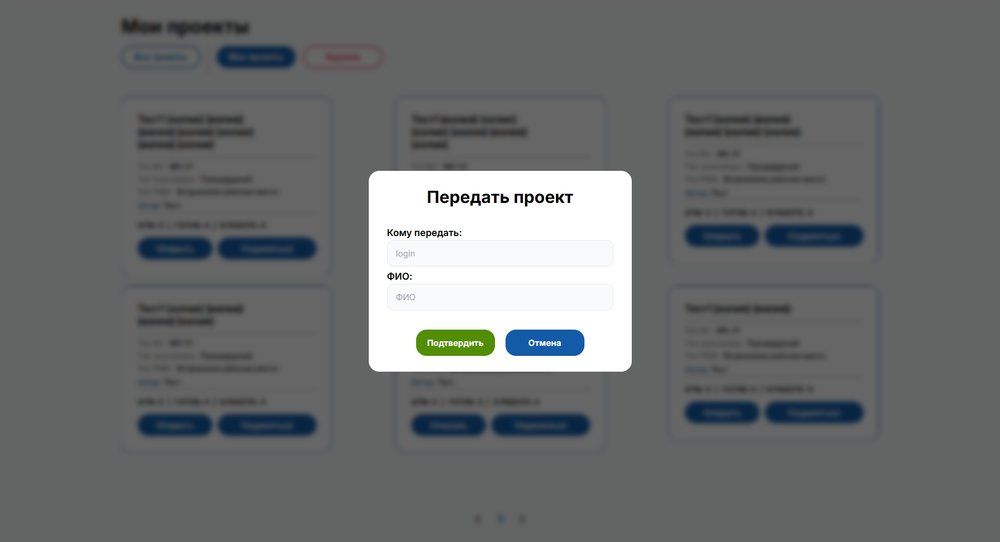
Рис. 10. Модальное окно передачи проекта

### 3.3. Страница документов испытаний

Чтобы перейти к документам испытаний, которые содержатся в проекте необходимо нажать на кнопку «Открыть» на карточке проекта. Пользователь перейдет на страницу документов испытаний, где можно:
* Создать документ испытаний, нажав на поле создания.
* Переключить язык или выйти с сайта.
* Найти проект при помощи поля поиска сверху.
* Листать карточки, если их становится много.
* Вернуться на страницу проектов при нажатии на логотип «АТМ КОНСТРУКТОР».

Также сами карточки документов испытаний могут быть распределены относительно их статуса для удобного просмотра (рис. 11).

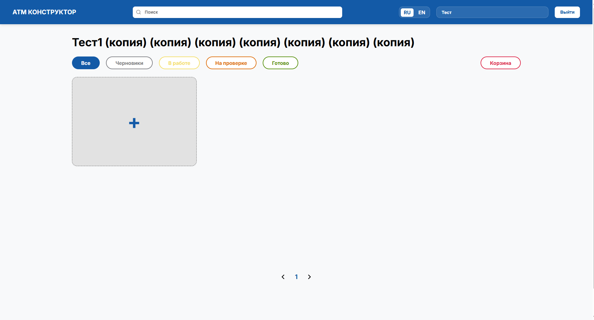
Рис. 11. Основной вид страницы документов испытаний

Для того, чтобы создать проект будет необходимо выбрать код ATA или FSTD и код системы из выпадающего списка, остальные поля заполнятся автоматически (рис. 12).

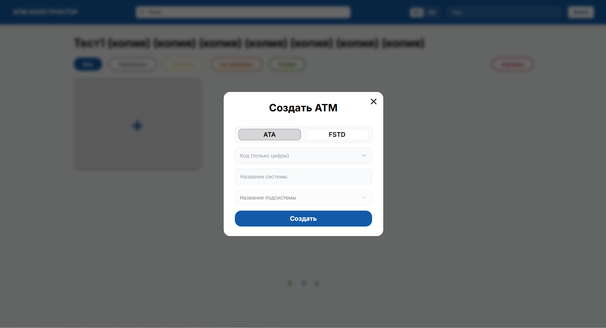
Рис. 12. Модальное окно создания документа испытания

У пользователя также есть возможность редактировать и удалять карточку, нажав на соответствующие иконки (рис. 13) и восстанавливать проект (рис. 14).

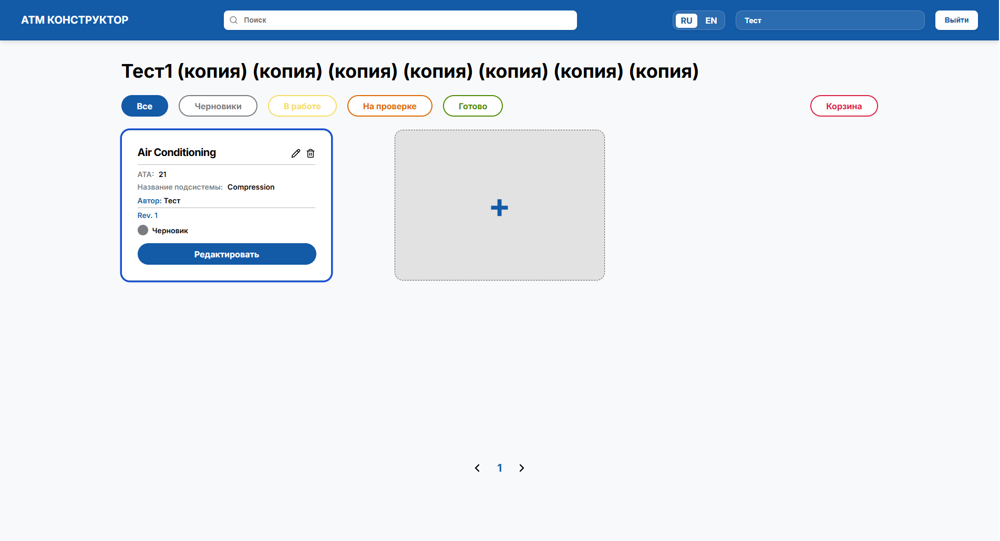
Рис. 13. Иконки на карточке для редактирования и удаления карточки документа испытаний

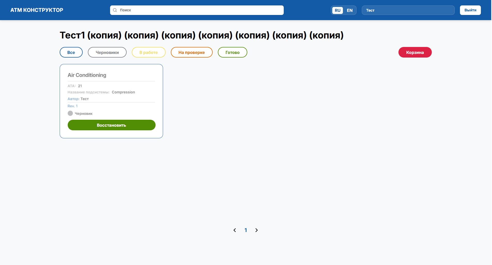
Рис. 14. Кнопка восстановления на карточке в корзине

Если пользователь перешел по чужой карточке для просмотра – у карточки документа испытаний также будет кнопка «Посмотреть» (рис. 15).

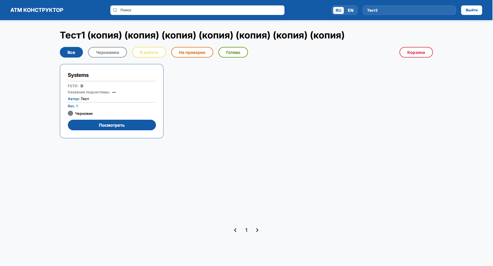
Рис. 15. Кнопка просмотра на карточке документа испытаний, появляющаяся при заходе в чужой проект

### 3.4. Страница редактора

Для того, чтобы перейти на страницу редактора необходимо нажать на кнопку «Посмотреть» (если проект чужой) или кнопку «Редактировать» (если этот проект создал пользователь). При переходе пользователь сразу же окажется на вкладке «Основная часть», где он сможет формировать основную часть документа, выбирая действия и проверки.

В верхней части страницы пользователю доступно:
* Кнопка «Назад» для перехода обратно на страницу документов испытаний.
* Указание названия системы, код и ревизия.
* Строчка автосохранения, сохраняющая документ испытаний каждые 5 минут.
* Переключатели вкладок для заполнения разделов.
* Смена статуса карточки.
* Кнопки сохранения и экспорта в Word (экспортирует сформированный документ).
* Переключение языка (рис. 16).

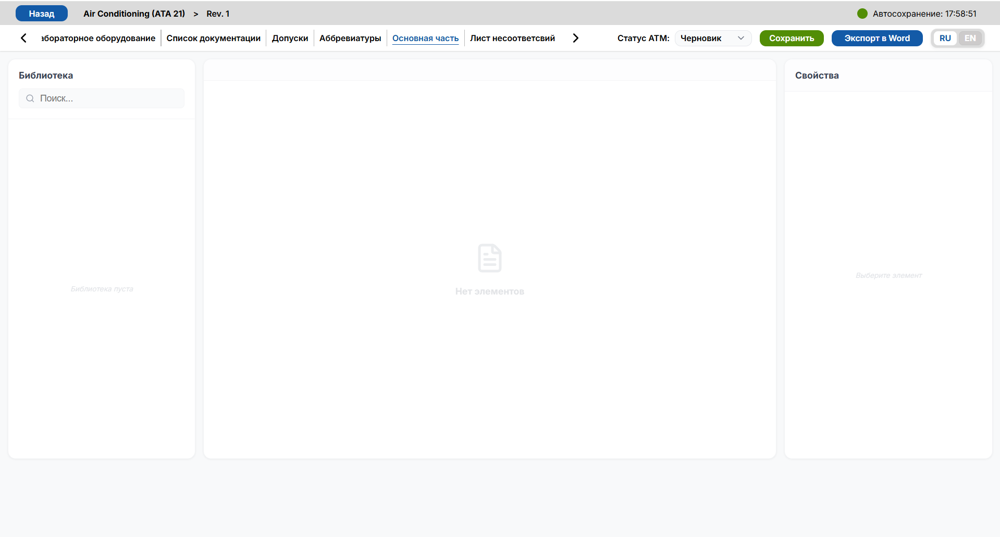
Рис. 16. Вкладка «Основная часть» для создания основной части документа испытаний

Для формирования каждого раздела документа испытаний необходимо переходить на одноименные вкладки этих частей для дальнейшего их заполнения. Все поля и названия столбцов на этих вкладках строго необходимы для правильного формирования документа испытаний.

#### Вкладки редактора:

* **Титульный лист:** Содержит разделы «Общие сведения» (заполняются автоматически на основе карточки проекта и не редактируются). В разделе «Документ» поля ввода необходимо заполнять самостоятельно (ревизия выбирается автоматически последняя). В разделе «Организация» загружаются логотипы заказчика и исполнителя. Доступна кнопка предпросмотра титульного листа без скачивания (рис. 17).

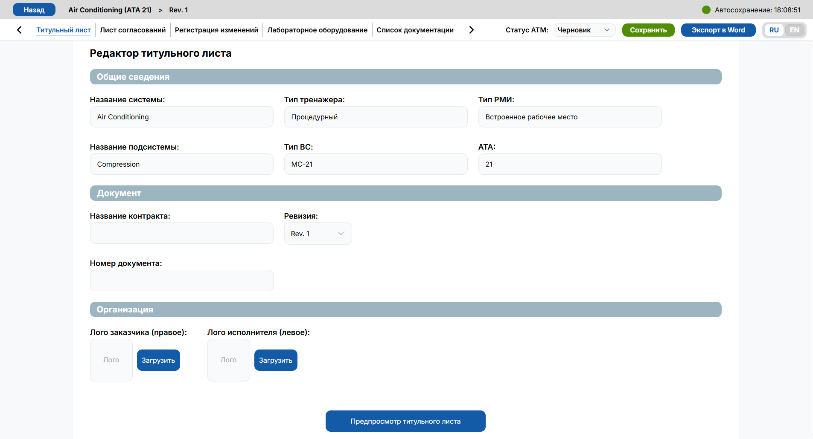
Рис. 17. Вкладка «Титульный лист» с изначальным заполнением

* **Лист согласования:** Содержит таблицу с кнопкой «Добавить компанию». Добавляется строка с полями названия компании и кнопкой добавления ее представителей (с указанием должности и ФИО). Доступна кнопка предпросмотра листа согласования (рис. 18).

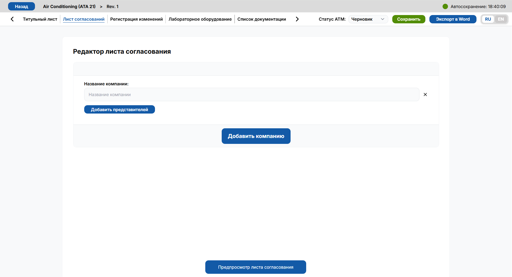
Рис. 18. Вкладка «Лист согласования» с возможностью добавления, редактирования и удаления компании и ее представителей

* **Регистрация изменений:** Таблица с указанием первоначальной ревизии и полем «Описание изменений». В первоначальной ревизии поле «Причина» необязательно. Во всех остальных ревизиях поля «Причина» и «Описание изменений» заполняются вручную. Предусмотрена возможность редактирования даты ревизии. При добавлении новой ревизии предыдущая блокируется для редактирования (доступен только просмотр и экспорт). Доступна кнопка предпросмотра (рис. 19).

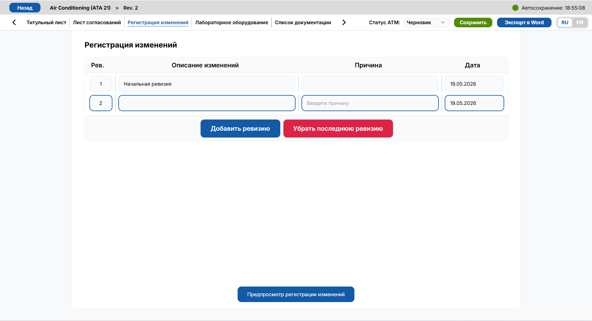
Рис. 19. Вкладка «Регистрация изменений» с возможностью добавления и удаления ревизий, просмотр старых без возможности их редактирования

* **Лабораторное оборудование:** Таблица с кнопкой добавления оборудования, полями для Наименования, Модели и даты Калибровки. Доступна кнопка предпросмотра (рис. 20).

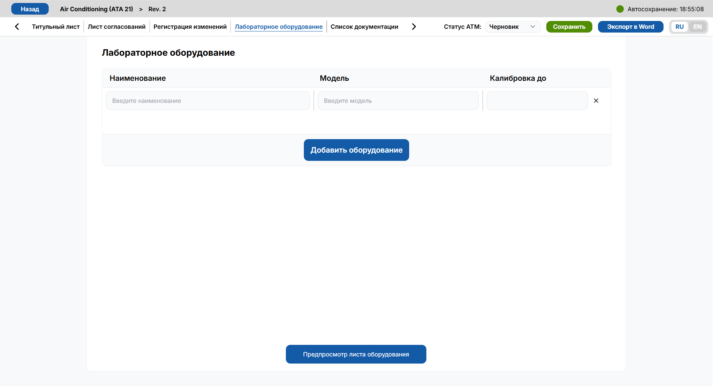
Рис. 20. Вкладка «Лабораторное оборудование» с возможностью создания, редактирования и удаления различного оборудования

* **Список документации:** Таблица добавления документов с полями «Номер документа», «Rev.» и «Название документа». Доступна кнопка предпросмотра (рис. 21).

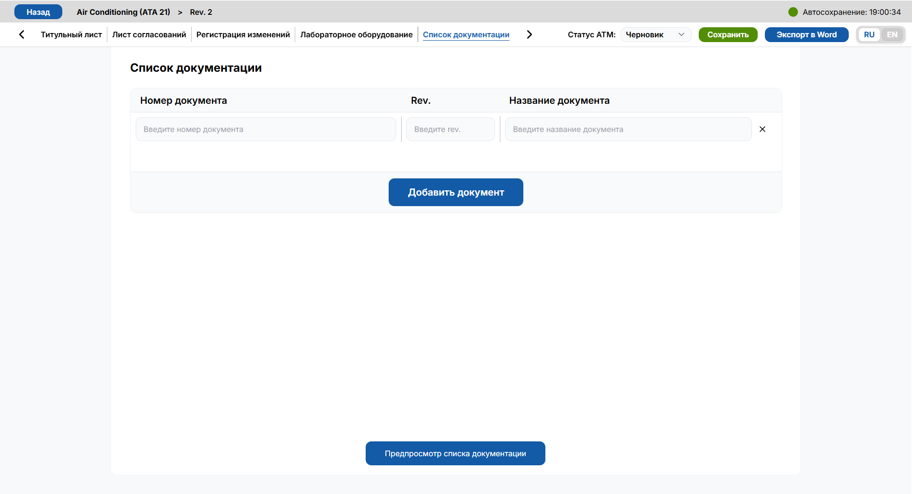
Рис. 21. Вкладка «Список документации» с возможностью создания, редактирования и удаления различных документов

* **Допуски:** Таблица с кнопкой добавления допусков, содержащая поля ввода, а также выпадающие списки для выбора допусков и единиц измерений. Доступна кнопка предпросмотра (рис. 22).

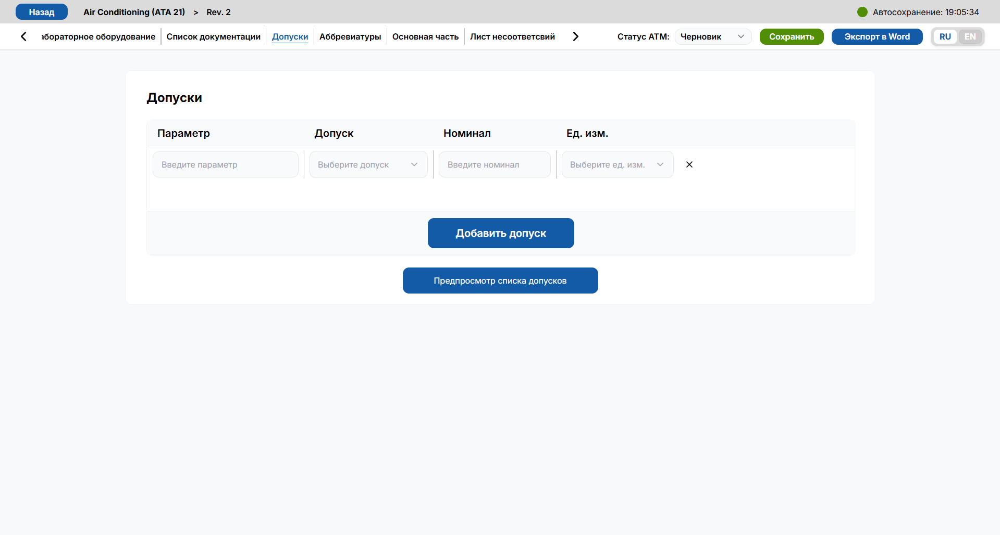
Рис. 22. Вкладка «Допуски» с возможностью создания, редактирования и удаления различных допусков

* **Аббревиатуры:** Таблица с кнопкой добавления сокращений, содержащая выпадающий список для выбора сокращений и поле «Расшифровка». Доступна кнопка предпросмотра (рис. 23).

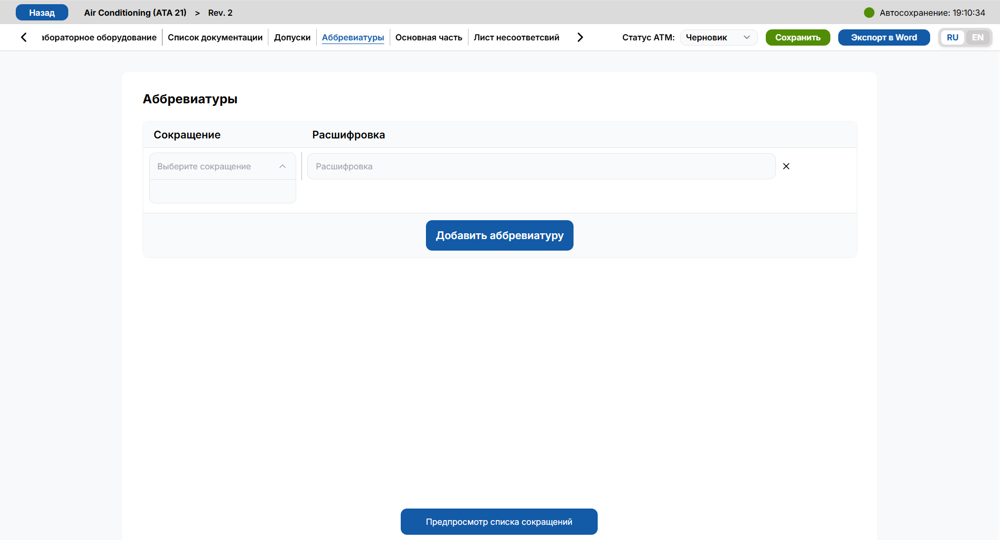
Рис. 23. Вкладка «Аббревиатуры» с возможностью создания, редактирования и удаления различных сокращений

* **Лист несоответствий:** Содержит кнопку для перехода в АТР-Конструктор, предназначенный для заполнения уже после проведения реальных испытаний.

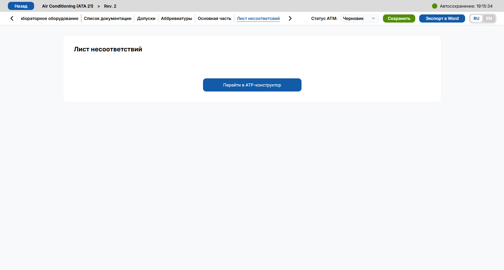
Рис. 24. Вкладка Лист несоответствий

## 4. Ситуации, при которых возникают ошибки 

В веб-сервисе при возможности возникновении каких-либо конфликтных ситуаций предусмотрены специальные ошибки для того, чтобы их можно было избежать:

* При нажатии на кнопку входа без заполненных полей или если логин и пароль являются неправильными в форме входа возникает ошибка «Неверный логин или пароль».
* При нажатии на кнопку регистрации без заполненных или частично-заполненных полях в форме регистрации возникает ошибка – под незаполненными полями появляются надписи «Введите ФИО», «Введите логин» и «Введите пароль» соответственно. Если пароль не подходит условию - пароль должен содержать минимум 8 символов и латинские буквы (a-z) выскакивает ошибка с данным текстом.
* При создании нового проекта или документа испытания в модальном окне их создания если такой проект или документ испытаний уже существует возникнут ошибки - «Создать проект не получится. Такой проект уже есть» и «Создать АТМ не получится. Такой АТМ уже есть» соответственно.
* При передаче проекта в модальном окне если не заполнить поле логина возникнет ошибка - «Поле login обязательно для заполнения». Также если такого пользователя не существует возникнет ошибка - «Ошибка. Пользователь не найден».
